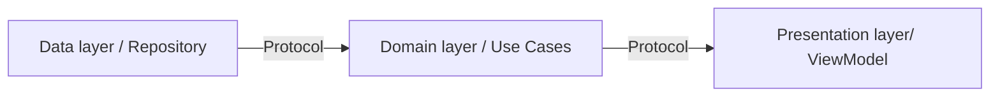

# Transactions

This is a demo project on how you could display and animate transactions.
This is in no way a finished project and should be taken as so.
It is more a showcase of how could be implemented different technical iOS project elements.

# What

- [x] Remote modular network & design system
- [x] Uses of Apple's [Combine](https://developer.apple.com/documentation/combine)
- [x] Uses of Apple's new structured concurrency (Async/Await)
- [x] MVVM clean architecture
- [x] Dependency injection with Factory
- [x] SwiftUI
- [x] Tested
- [x] SwiftLint & SwiftFormat

## Getting Started
* [Installation](#installation)
* [Technical Choices](#technical-choices)
    * [SwiftUI](#swiftui)
    * [MVVM](#mvvm)
    * [Clean Archi](#clean-archi)
    * [Dependency injection](#dependency-injection)
    * [Modular](#modular)
    * [Protocols](#protocols)
* [Explained Architecture](#explained-architecture)
    * [Components](#components)
    * [Interactions](#interactions)
* [Tools](#tools)

# Installation

Just check out the repository and open the project. The project is available for iOS >= 16.
You will need to have swiftlint and swiftformat installed to be able to compile.

## Technical Choices

### SwiftUI

The project was created using only SwiftUI.

### MVVM

The main architecture implemented in this project is based on MVVM pattern.
This pattern works really well with SwiftUI and is well know making it easy to implement and scale.

### Clean Archi

The clean architechture is implemented with 3 levels.
- Presentation (Views)
- Domain (Use cases)
- Data (Services)

### Dependency injection

The project uses dependency injection extensively.
The main DI tool used is [Factory](https://github.com/hmlongco/Factory). It is very light but yet very powerful.
The DI implementation is applied with the `@Injected` property wrapper.

### Modular

The project contains 2 local swift package, `EasyNETWORK` and `TransactionDesignSystem`. This is to showcase how you can easily start modulate a project.
If the modules needed to be reused later we could set them in there own git repository.

### Protocols

Of course no good DI is implemented without the use of protocols.
This project make use of this aspect extensively to not create strong links between the different elements of the architecture.

## Explained Architecture

The project is based on a MVVM structure. It also incorporates some notions of clean architecture.

### Components

- Presentation layer:
The presentation layer is contained in the `Scenes` folder. It regroups all the `views` and `viewmodels`

- Domain layer:
The domain layer can be found in the `Shared\DomainLayer` folder. It contains the `UseCases`. It also has the protocols link to this layer.

- Data layer:
The data layer is located in the `Shared\DataLayer` folder. It contains the `repositories`, `Services`, `General Tooling`.
It also contains protocol linked to this layer and specific models.

### Interactions

This project make heavy use of protocols so all layer are connected through them.
The connections between elements are made with dependency injection and rely on protocols to make it easy to modify the existing code and testing.

In the project this translates into:

Presentation:
`ViewModel` contains `UseCases`. These `UseCases` are injected.

Domain:
`FetchXXXX` responds to `FetchXXXUseCase`protocol and depends on a `xxx repository`.

Data:
`Repositories`/ `Services` are the core of this layer. They all implement protocols that are used in other layer for DI.

# Tools

## Swiftlint

This is the main linter for the project.
If you don't have this tool installed please refer to the following link to set it up: [SwiftLint](https://github.com/realm/SwiftLint)
The configuration for this tool can be found in the `.swiftlint.yml` file.

## SwiftFormat

This is the main code reformatting tool for the project.
If you don't have this tool installed please refer to the following link to set it up: [SwiftFormat](https://github.com/nicklockwood/SwiftFormat)
The configuration for this tool can be found in the `.swiftformat` file

## SwiftGen

This is a tool to type safe asset / Strings / Colors
It is link to the design system package and automatically generates files the the need infos for all assets. 
The configuration for this tool can be found in the `.swiftgem.yml` file in `TransactionDesignSystem`
